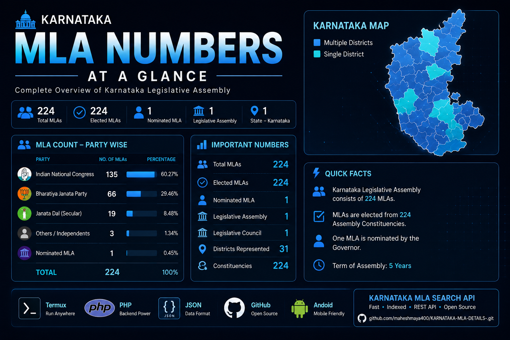
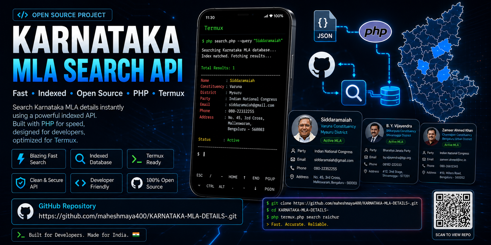
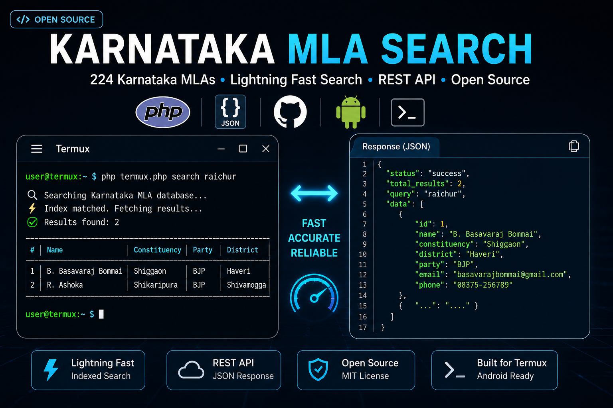
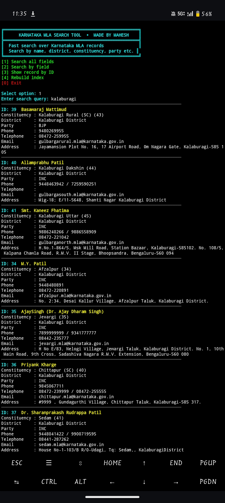

# Karnataka MLA Search API 🇮🇳

<p align="center">
  
</p>

<p align="center">


</p>

A blazing-fast **PHP Search API** and **Termux CLI Tool** for searching all **224 Karnataka Legislative Assembly (MLA)** records.

---

# ✨ Features

- 🚀 Lightning Fast Indexed Search
- 🔍 Search by Name
- 🗺 Search by District
- 🏛 Search by Constituency
- 🏷 Search by Party
- 📞 Search by Phone
- 📧 Search by Email
- 🆔 Search by Constituency Number
- 💻 Interactive Termux Tool
- 📦 Pure PHP
- ⚡ No Database Required
- 📱 Android Compatible

---

## Home Screen

<p align="center">

</p>

## Search Results

<p align="center">

</p>

## Show All 224 MLAs

<p align="center">

</p>
---

# 📂 Installation (Termux)

## Update Packages

```bash
pkg update && pkg upgrade -y
```

## Install Dependencies

```bash
pkg install php git -y
```

## Clone Repository

```bash
git clone https://github.com/YOUR_USERNAME/karnataka-mla-search-api.git
```

## Open Project

```bash
cd karnataka-mla-search-api
```

## Start API

```bash
php -S 0.0.0.0:8000
```

Open

```
http://127.0.0.1:8000/search.php?q=raichur
```

---

# 📱 Termux Tool

Run Interactive Mode

```bash
php termux_tool.php
```

Quick Search

```bash
php termux_tool.php search siddaramaiah
```

```bash
php termux_tool.php search raichur
```

```bash
php termux_tool.php search bjp
```

Show All MLAs

```bash
php termux_tool.php list
```

Lookup by ID

```bash
php termux_tool.php id 53
```

---

# 🌐 API Examples

```
GET /search.php?q=raichur
```

```
GET /search.php?q=bjp
```

```
GET /search.php?id=53
```

```
GET /search.php?district=Raichur
```

---

# 📁 Project Structure

```
assets/
banner.jpg

politicians.json
search_index.json
search.php
termux_tool.php
build_index.php
README.md
```

---

# ⭐ Support

If you like this project, give it a ⭐ on GitHub.

---

# 👨‍💻 Author

Mahesh

Made with ❤️ in Karnataka
